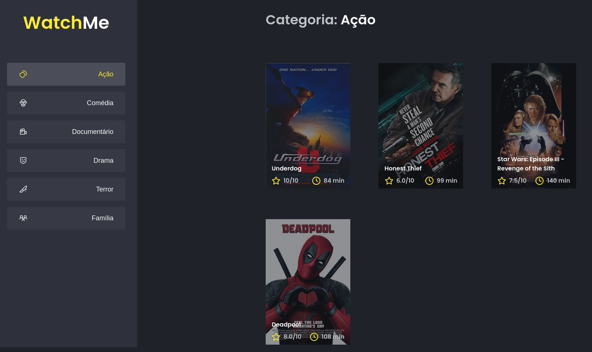

# WatchMe

Application using ReactJS developed in the Rocketseat Ignite course.

## Technologies

Technologies used to build the application

- [ReactJS](https://reactjs.org/)
- [TypeScript](https://www.typescriptlang.org/)

## Screenshots

<div align="center" id="top"> 
  
</div>
<br/>
<br/>

```bash
# Clone this project
$ git clone https://github.com/ewertonspezia/watchMe

# Access
$ cd watchMe

# Install dependencies
$ yarn

# Run the project
$ yarn server
$ yarn dev

# The server will initialize in the <http://localhost:8080>
```
